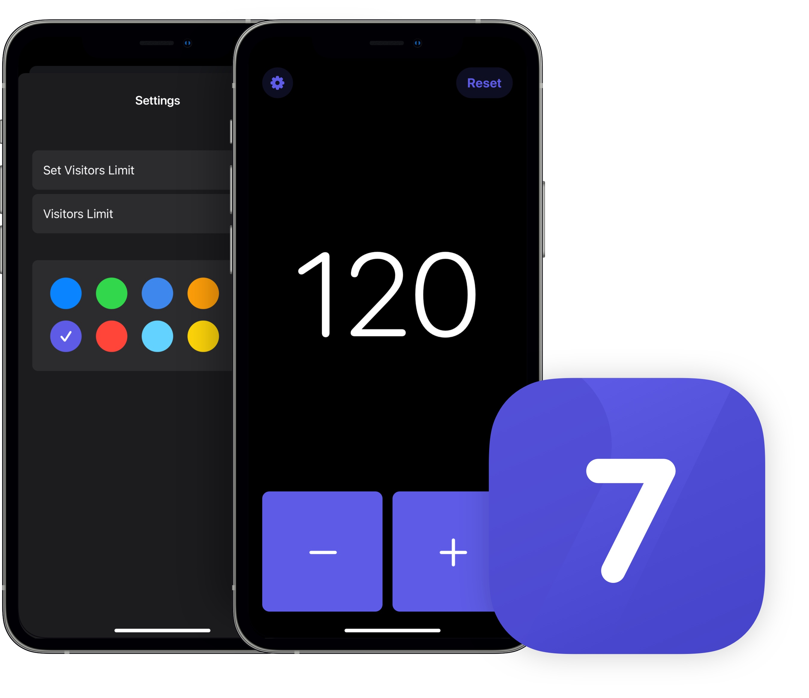

# Countr - Visitors Counter

*Countr - Visitors Counter* is a simple and beautiful counter to easily track footfall in shops or event venues, helping businesses keep their spaces and guests under control.

## Introduction and Goals

Countr is my first app on AppStore. - it's a very simple app for a very specific use case.

Just like [Taskable](https://github.com/ruipasilva/Taskable), I've developed this app thinking of the daily routine I've got in store (I'm a retail manager). With Covid-19 most, if not all, stores were forced to control their traffic, we currently use a completely outdated app designed pre iOS7, so I wanted to create something more pleasing, appeling to the eye and really easy to use. 

Currently developing v1.1

Version 1.0 | Version 1.1 (coming soon)
------------ | -------------
Tally up number of visitors | Settings added
Reset count to 0 | Limit visitors
"" | Change app theme
"" | Visitors limit warning
"" | Display how many visitors over the limit

## Technologies

* SwiftUI
* Core Haptics

## Contact

Please Visit http://www.ruisilva.xyz to reach out.
